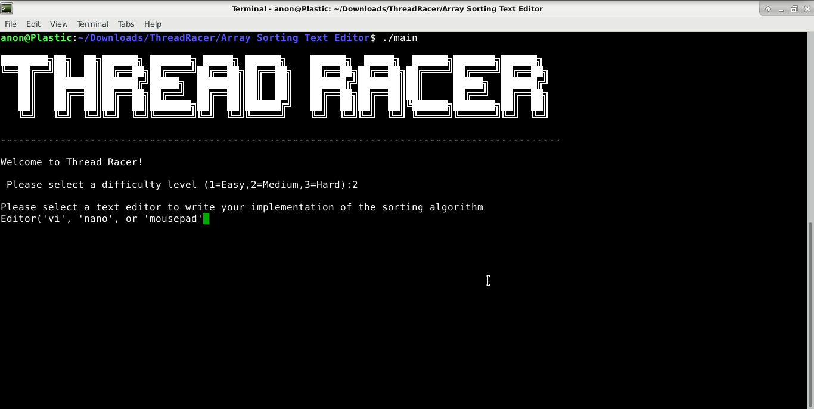
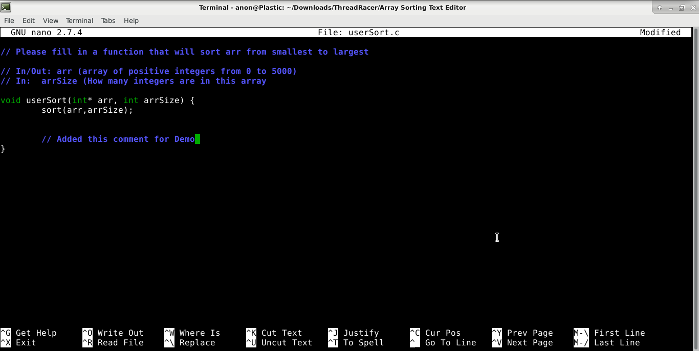
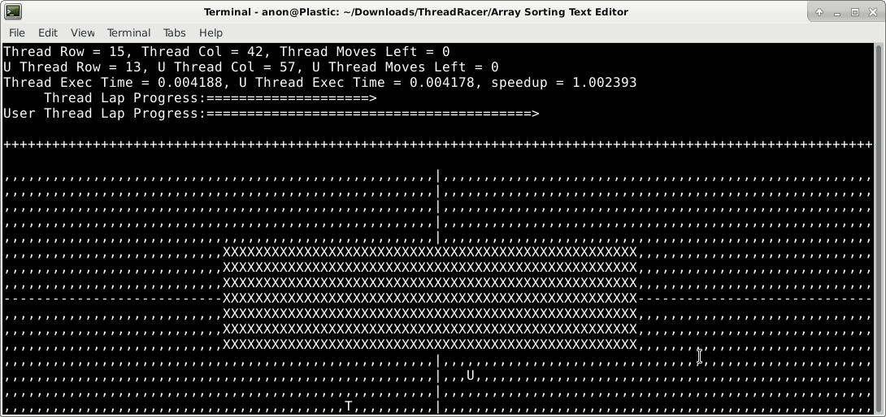
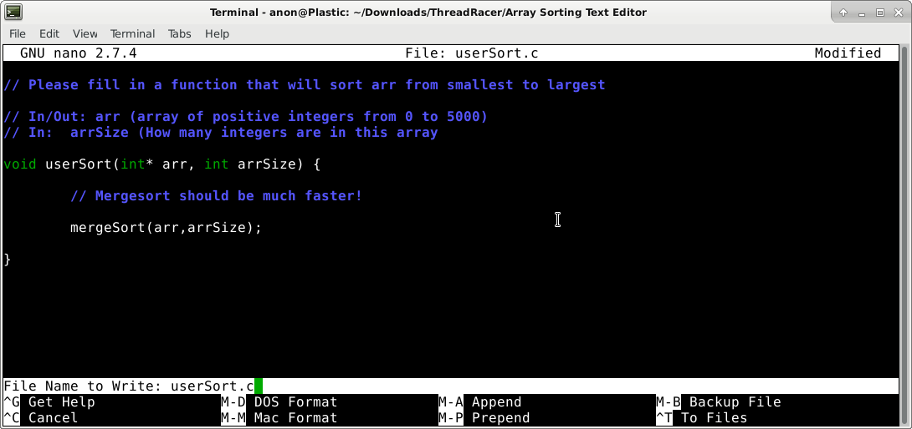
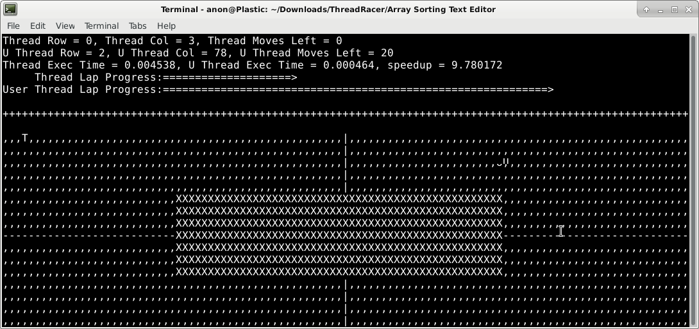
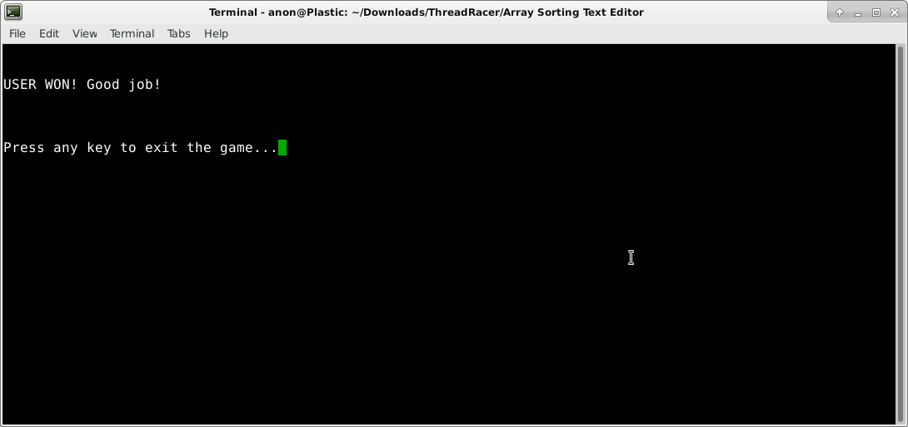

# ThreadRacer

Notice the much higher speedup value above from mergesort!

# Game Description:

ThreadRacer is an optimization learning tool / game in which the user provides code to solve
a given problem (array sorting) and receives a speed boost in a 2D racing game proportional to the
speedup that their code confers over the baseline.

The user is provided a text editor of their choice to code a solution to the sorting problem described,
with the intent being that they implement optimizations like loop unrolling, cache blocking, and common
subexpressions (whichever may be relevant for a sorting algorithm).

The 2D racing game representation is run using the ncurses text display library.

The racing game will dynamically resize depending on the starting window size.

The user's character and the "computer's character" are both controlled by keyboard input. (wasd and numpad 8456)

# Installation (On Debian Stretch)

Installation just requires the virtual package "libncurses-dev"

	sudo apt install libncurses-dev
	
# Compiling

Compile in any of the concept subdirectories with the following command
	
	gcc main.c -lpthread -o main
	
If the above command has linker issues (may occur on some distros), use the following command
	
	gcc main.c -lpthread -lncurses -o main
	
# Running

Running the code is as easy as running the executable you created. No arguments are necessary
	
	e.g.
	
	./main
	
Follow the onscreen instructions to play the game!
	
# Playing
	
Controlling the thread racers requires the use of the below controls
	
	WASD keys 
	Numpad 8456 keys
	
The winner of the race is displayed once someone crosses the finish line
	